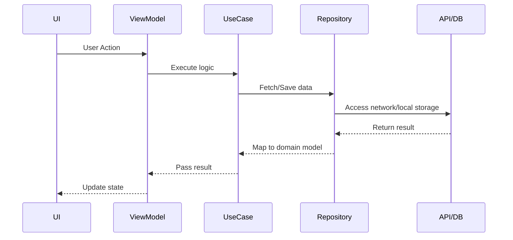

# 🧼 Clean Architecture with MVVM – Android App Template

This repository showcases a **Clean Architecture** approach combined with **MVVM (Model-View-ViewModel)** for building scalable, maintainable, and testable Android applications using **Kotlin** and **Jetpack components**.

---

## ✨ Key Features

- ✅ Modular architecture with clear separation of concerns
- 🧪 Built for unit & UI testability
- 🚀 Scalable codebase with SOLID principles
- ♻️ Reusable components using MVVM + Clean layers
- 💡 Uses best practices: Coroutines, Flows, Dependency Injection, Retrofit, Room

---

## 🏛️ Architecture Overview

---

## 🧱 Architectural Layers Breakdown

### 🎨 Presentation Layer (UI & MVVM)

- **📌 Purpose:** Handles UI and user interactions.
- **🧩 Components:** 
  - Activities / Fragments
  - Jetpack Compose UI
  - ViewModels
- **🔁 Role:**
  - UI observes ViewModel’s state
  - ViewModel handles logic and communicates with UseCases

---

### 🧠 Domain Layer (Business Logic)

- **📌 Purpose:** Contains core app rules, **independent** of framework or data source.
- **🧩 Components:**
  - UseCases
  - Repository Interfaces
  - Domain Models
- **🔁 Role:**
  - UseCases drive the app’s business logic
  - Interfaces abstract data sources

---

### 📦 Data Layer (Repository + Sources)

- **📌 Purpose:** Manages **local** and **remote** data sources.
- **🧩 Components:**
  - Repository Implementations
  - API Services (Retrofit)
  - Room Database
  - DTOs & Mappers
- **🔁 Role:**
  - Implements domain layer repositories
  - Maps DTOs ↔ Domain Models

---


## 🔄 Data Flow Explained


## 🚀 Getting Started

### 1️⃣ Clone the Repository

```bash
git clone https://github.com/waleedshoukat098/CleanArchitecture.git
```
## 🙌 Support & Feedback

If you find this project helpful:

- ⭐ **Star this repository**  
- 🤝 **Fork it and contribute**  
- 🧠 **Share feedback or suggestions**

### 📬 Contact Me

- **📧 Email:** [waleedshoukat016@gmail.com](mailto:waleedshoukat016@gmail.com)  
- **🔗 LinkedIn:** [linkedin.com/in/waleedshoukat](https://www.linkedin.com/in/waleedshoukat)  
- **🐙 GitHub:** [github.com/waleedshoukat098](https://github.com/waleedshoukat098)


